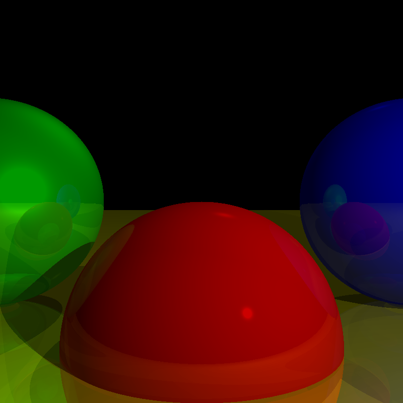

# Overview
This is a basic raytracer written from scratch in C++. It is designed to be cross-platform. Despite its simplicity,
this raytracer can produce basic images with reflections and shading.

## Features
- Basic raytracing capabilities
- Configurable image resolution and scene parameters
- Phong Lighting
- Shadow
- Reflections

## Supported Shapes (*more to be added*)
- Sphere

## Building and Compiling

### Prerequisites
- A C++ compiler (e.g., GCC, Clang, MSVC)
- [Premake5](https://premake.github.io/download)
- [Lua](https://www.lua.org/download.html)

### Building
- Get the code `git clone https://github.com/CatB1t/raytracer.git`
- Clone `Lua` source code into the directory `vendor/lua/`
- In the project directory, run `premake5 [action]`, e.g. `premake vs2022`
- For toolsets like Visual Studio, you can simply load the generated solution IDE and build as you normally would.
- If you have generated makefiles, run `make`
- You will find the executable in the `build` directory, simply run `./raytracer`

### Options
- `-w` to specify width. default `800`
- `-h` to specify height. default `800`
- `-o` to specify output file. default `image`
